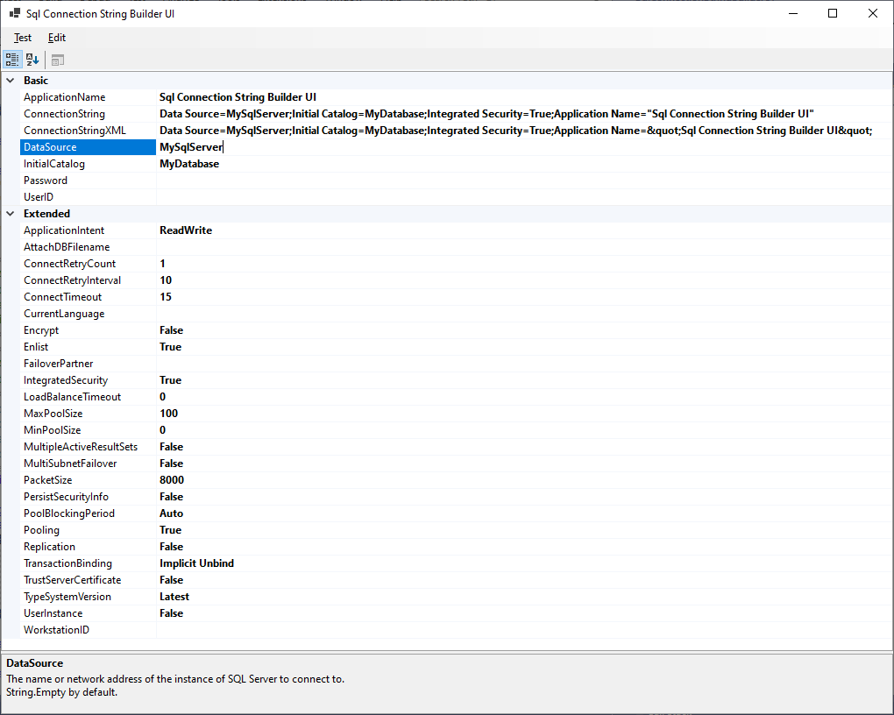
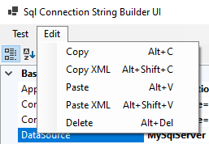

# SqlConnectionStringBuilder-UI

A user interface around
[System.Data.SqlClient.SqlConnectionStringBuilder](https://learn.microsoft.com/en-us/dotnet/api/system.data.sqlclient.sqlconnectionstringbuilder)
to help with... Building Connection Strings.

Each property has a description which appears at the bottom.

Connection Strings can be copy/pasted as plain text or as xml escaped text.

The Test menu item will try opening a connection using the Connection String.

The copy/paste shortcuts use alt instead of ctrl so they don't conflict with copy/pasting individual property values.

